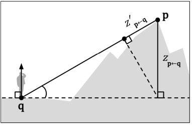
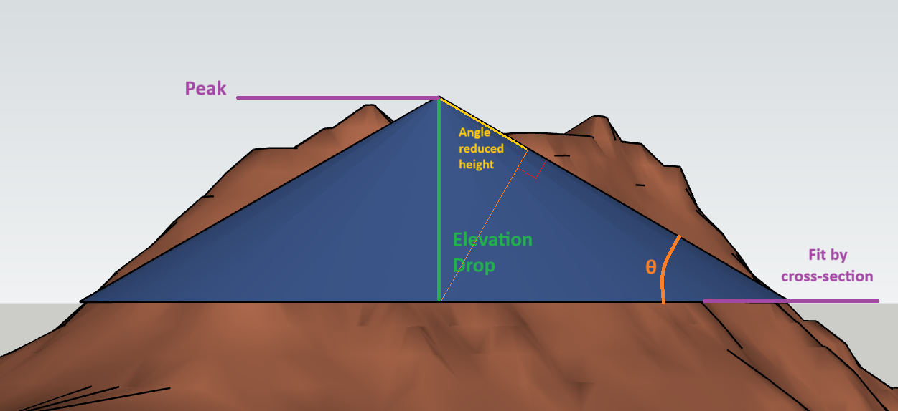
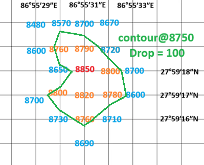
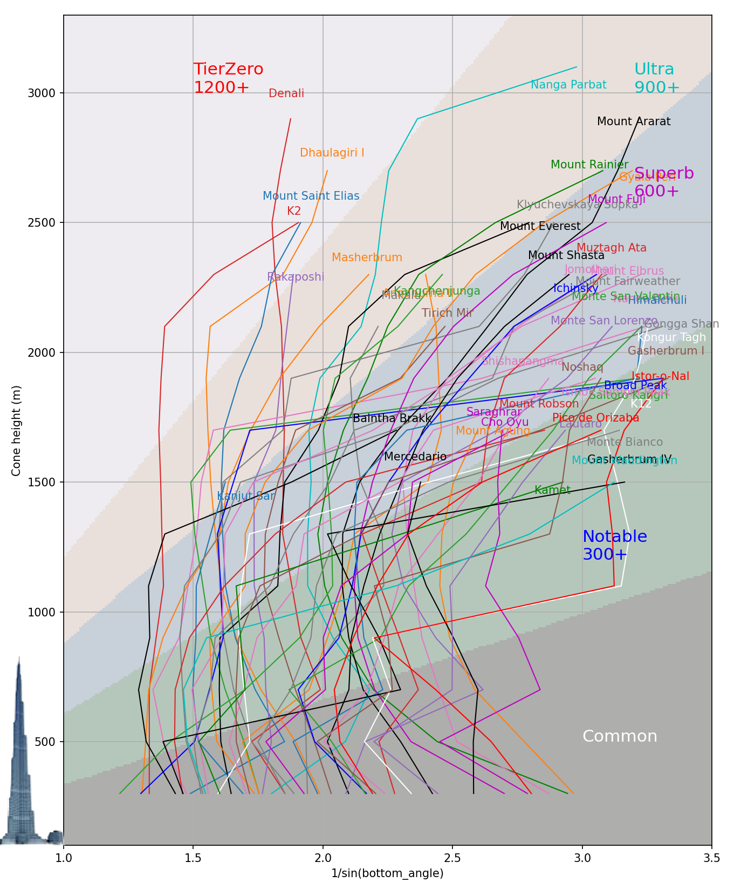
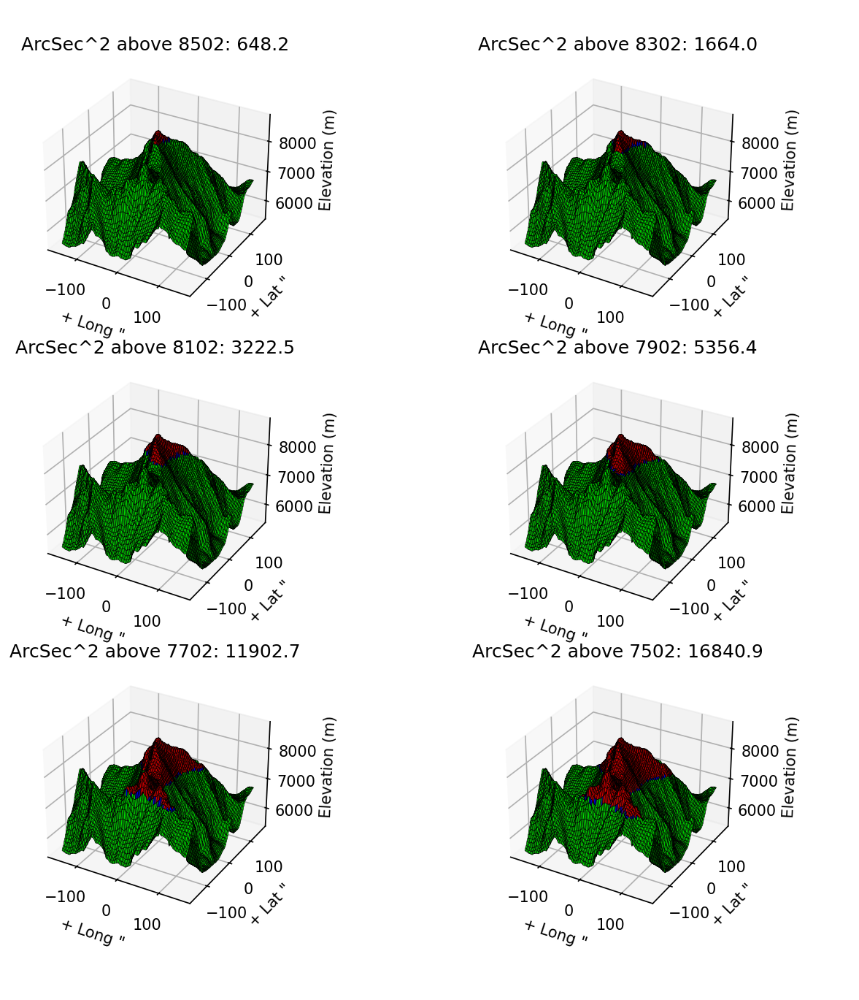

# Equivalent Tower Height (ETH): Which is the most magnificent of peak on the Earth?

## Introduction
When talking about the magnificence of a peak, people usually either talk about its elevation, relative height (rise),
or use photos and videos taken nearby. However, none of these traditional factors is both accurate and 
objective enough, to convince one peak is more magnificent than another.

| Criteria                  | Definition                   | Problems                                                  |
|---------------------------|------------------------------|-----------------------------------------------------------|
| Elevation                 | Rise from sea level          | Most peaks locate far from sea                            |
| Topological Prominence    | Rise from key col            | Key col may be thousands of kilometers away, like Everest |
| Visual evidence           | photos, satellite data, etc. | Hard to quantify |

Kai Xu introduced the concept of "jut" (described in more detail below), to measure its maximum degree of rise from 
a nearby terrain. While jut provides a better measurement of the peak's impressiveness from a ground-observer's
perspective, it usually favors tall cliffs or walls over peaks itself. This property sometimes diverts jut from
 the traditional definition of mountain peaks, especially in such cases:
- Peaks with high jut are not necessarily hard to climb. There usually exist routes that go around the steep cliff.
- Peaks with high jut are not necessarily noticeable from height, if they form relatively flat ridges with nearby peaks.

Equivalent Tower Height (ETH), arisen from the concept of "jut", works better in those aspects.
Peaks with high ETH is not only guaranteed to look impressive from any direction, but also are hard to summit. Moreover,
as an "averaged" version of jut, ETH is more resistant to noise in local terrain height data, allowing the computation
from civil-precision data.

## Jut: how much a peak rises from a ground observer
Jut of a peak P is defined as the maximum angle-reduced height of P above all surrounding points:

`jut(P) = max[h * sin(θ)] for any chosen Q`



## ETH: Jut applied to a cone-fitted peak
By definition, jut depends on the optimal observation location. To overcome this, we first fit a mountain peak to a perfect cone, then compute the cone's jut.
As a cone is fully symmetric by rotation, the problem is reduced from 2-dimensional to a 1-dimensional.

Now the question is, how do we fit a peak (precisely speaking, a certain section below the summit) to a cone?

There exist many methods where an irregular shape fits into a ideal geometry, such as volume-based, cross-section-based,
rotational-inertia-based. For simplicity, cross-section-based fitting is adopted in this work.
```
    Init: Eth <- 0
    for vertical_drop := 1..elevation below the summit,
        A <- Maximum connected area (including peak) with elevation >= (summit_elevation - vertical_drop)
        S <- area(A)
        R <- sqrt(S / PI)
        Alpha <- arctan(vertical_drop / R)
        AngleReducedHeight <- vertical_drop * sin(θ)
        Eth <- max(Eth, AngleReducedHeight)
    Return: Eth 
```


The name "Equivalent Tower Height", comes from its close relationship with human-made towers. A perfectly-slim tower,
with nearly-zero cross-section along its entire height, receives ETH identical to its height. Therefore, some of the tallest
human-made structures have ETH comparable to major mountain peaks.

## Evaluation with real-world data
### Elevation dataset
We choose ASTER Global Digital Elevation Model V003 due to its public accessibility at earthdata.nasa.gov.
The dataset features a spatial resolution of 1 arc second (~30m). Although it claims to have a elevation precision
of 16 meters, it's observed to be much poorer in areas with rugged terrian. For instance, the highest point in the
dataset is only 8802m, about 50m below Mt Everest's true elevation 8849m. If a peak measures 5%
lower than its true elevation, we will skip its evaluation to avoid wrong results.

### Compute maximum connected area from grid samples
We perform a DFS or BFS starting from the peak point to get set S, where every point in S is
higher or equal to elevation_threshold = peak_elevation - elevation_drop.
 
All quads Q containing at least 1 vertex in S is taken into consideration:
1. If all 4 vertice are in S, count Q as a full grid.
2. Otherwise, perform an interpolation on two of its edges and form a straight line across Q with elevation == elevation_threshold. 
Count Q as a partial grid sliced by the straight line.

This illustration shows how we define Mt Everest's area above 8750m by interpolating a contour. 
Elevation data is imaginary for display only.


Once we know the number of grids, we can multiply it by a single grid (1 by 1 arc second)'s area, which only depends on latitude.

This calculation method provides relatively accurate estimation at reasonable implementation complexity.

### Peak selection
We use two lists on wikipedia, providing 213 peaks combined.
1. https://en.wikipedia.org/wiki/List_of_mountain_peaks_by_prominence
2. https://en.wikipedia.org/wiki/List_of_highest_mountains_on_Earth

### Cut-off
Although there's no limit how far vertical drop can extend to, we are not interested in areas too far from the summit, 
where the cone has become too flat to result in high ETH values. We increase vertical drop until the following criteria is reached:
1. Connected area reaches 30 kilometers from peak;
2. sin(Alpha) < 0.30 AND vertical_drop >= 1000 meters.

Additionally, vertical drop starts from 300 meters to lower the effect of data noise around the summit,
and increases at the step of 200 meters.
These thresholds work well for ultra prominent and high peaks, but need be different for lower and more flat ones.

## Result
### Tier Zero Club (Overall Maximum)
> Noticeably, Alaska stands out from the rest of ~8000m giants.

| Name             | ETH    | True Elevation (observation error)  |
|------------------|--------|----------------------------|
| Denali/Mckinley  | 1546   |  6190 (-0.3%)  |
| K2/Qogir         | 1511   |  8611 (-0.8%)  |
| Dhaulagiri I     | 1342   |  8167 (-0.3%)  |
| Mount Saint Elias| 1306   |  5489 (-0.2%)  |
| Nanga Parbat     | 1227   |  8126 (-0.7%)  |
| Rakaposhi        | 1220   |  7788 (-1.6%)  |

### Front runner within each elevation drop range
> Those peaks are the steepest among those of similar scale.

| Name             | Elevation Range    | Max slope angle (degree) within range | True Elevation (observation error)  |
|------------------|--------|-------------|---------------|
| Baintha Brakk/The Orge | 500~1300   | 50 |7285 (-1.4%)       |
| K2/Qogir         | 1300~2400   |  49 | 8611 (-0.8%)       |
| Denali/Mckinley     | 2400~2900   | 34 | 6190 (-0.3%)  |
| Nange Parbat | > 2900 | 25 | 8126 (-0.7%) |

### Steepest @ last 700m till summit
> These peaks only welcome the most skilled climbers.
No surprise, Karakoram dominates.

| Name             | Slope angle (degree)    | True Elevation (observation error)  |
|------------------|--------|----------------------------|
| Baintha Brakk/The Orge  |  50  |  7285 (-1.4%)  |
| K1/Masherbrum         | 49   |  7821 (-0.8%) |
| K2/Qogir     | 49   |  8611 (-0.8%)  |
| Nanda Devi     | 48   |  7816 (-0.3%)  |
| Muztagh Tower  | 45   |  7276 (-3.6%)  |

### How steepness changes with elevation drop
The following plot has X axis inversed: `1 / sin(θ)`. Points with greater **slope**, i.e. 
closer to top-left area, reaches greater ETH.

Peaks less than 900 ETH are partially shown due to tidiness 
consideration. Please refer to the appendix for the full list.



## Appendix
### Maximum connected area evaluation for Mt.Everest at different elevations


### Full list of calculated ETH, ranked by elevation
|Peak|ETH|Latitude|Longitude|TrueElevation|ObservedElevation|sin(θ)@300|500|700|900|1100|1300|1500|1700|1900|2100|2300|2500|2700|2900|3100||||
|---|---|---|---|---|---|---|---|---|---|---|---|---|---|---|---|---|---|---|---|---|---|---|---|
|Mount Everest|1001|27.9881|86.925|8848|8802|0.60756109|0.622637542|0.624929977|0.623881295|0.547646492|0.54516749|0.5397619|0.50445177|0.484809739|0.476463911|0.431870273|0.357831109|||||
|K2|1511|35.88138889|76.51333333|8611|8546|0.75185289|0.751615566|0.751909776|0.737112555|0.722039413|0.725204364|0.727647516|0.731442571|0.726905966|0.719656381|0.63324784|0.52482485|||||
|Kangchenjunga|935|27.70333333|88.1475|8586|8552|0.822068687|0.708393516|0.588507417|0.523582767|0.490785381|0.491875189|0.495225614|0.499613878|0.488503675|0.436809127|0.406408156||||||||
|Lhotse|776|27.96166667|86.93305556|8516|8447|0.691358871|0.625479749|0.398900296|0.422674228|0.436720274|0.41922298|0.410951747|0.410592847|0.408359867|0.320098819|||||||||
|Makalu|949|27.88972222|87.08888889|8485|8252|0.515463466|0.516820253|0.518683375|0.487965882|0.447510035|0.44882229|0.466082459|0.471982144|0.475011597|0.451900793|||||||||
|Cho Oyu|640|28.09416667|86.66083333|8188|8174|0.518893075|0.56182065|0.497630101|0.499679255|0.483009286|0.429825026|0.426386706|0.366084761|||||||||||
|Dhaulagiri I|1342|28.69666667|83.49305556|8167|8146|0.503259162|0.527936083|0.567982683|0.600593175|0.622242801|0.630881635|0.63812181|0.642518894|0.645409227|0.638933811|0.541664705|0.510841414|0.495868451||||||
|Manaslu|850|28.55|84.55972222|8163|7942|0.563657302|0.578126113|0.598448825|0.604310877|0.611740677|0.490701752|0.473987096|0.448940553|0.447272195|0.336877135|0.332465463|0.313648011|0.304093914||||||
|Nanga Parbat|1227|35.23722222|74.58916667|8126|8066|0.554913246|0.479269192|0.458752365|0.490511128|0.515139702|0.515292471|0.511636163|0.513887345|0.502925813|0.465702793|0.45413468|0.449398293|0.44370015|0.422943203|0.335807007||||
|Annapurna I|642|28.59555556|83.82027778|8091|7900|0.428535029|0.480656323|0.468485708|0.447360189|0.452626943|0.375408271|0.36771993|0.331652445|0.309844402|0.305669344|||||||||
|Gasherbrum I / K5|666|35.72444444|76.69638889|8080|7991|0.582394622|0.600361271|0.600637585|0.596906081|0.569060152|0.465363518|0.443860697|0.35227769|0.300223504||||||||||
|Broad Peak / K3|990|35.81055556|76.56833333|8051|7999|0.770789533|0.664298766|0.640129671|0.619213858|0.622581348|0.627860507|0.604289975|0.582075036|0.301934991||||||||||
|Gasherbrum II / K4|690|35.75777778|76.65333333|8035|7968|0.687536457|0.559210097|0.576161713|0.513780932|0.517431555|0.530939297|0.362236261|0.340497131|||||||||||
|Shishapangma|662|28.35333333|85.77861111|8027|7945|0.446702052|0.499134312|0.461054962|0.446948154|0.436389426|0.409190148|0.384680617|0.368515018|0.348326158||||||||||
|Gyachung Kang|593|28.09805556|86.745|7952|7936|0.544669255|0.603498403|0.647064023|0.658833224|0.363607881|0.369280169|0.313492581||||||||||||
|Annapurna II|960|28.53472222|84.12194444|7937|7921|0.5704073|0.591758507|0.513633654|0.49561453|0.48025447|0.471347528|0.415976259|0.407085673|0.4087411|0.410429118|0.417353794||||||||
|Gasherbrum IV|644|35.76055556|76.61611111|7932|7796|0.684679358|0.722923118|0.434897262|0.451160468|0.474166375|0.495627631|0.316132161||||||||||||
|Himalchuli|732|28.43666667|84.63972222|7893|7769|0.505197616|0.530515533|0.448238291|0.463396853|0.46792753|0.471549044|0.469234263|0.430407265|0.311533187|0.309567337|||||||||
|Distaghil Sar|549|36.32583333|75.18777778|7884|7846|0.542764214|0.533277952|0.552224674|0.504710575|0.49900825|0.388240373|0.339908573|0.320590606|||||||||||
|Ngadi Chuli|E|28.50333333|84.56666667|7871|7247|||||||||||||||||||
|Khunyang Chhish|679|36.20527778|75.20777778|7823|7817|0.678433564|0.698808366|0.661534988|0.620222892|0.61354704|0.491013905|0.452607012|0.374786588|||||||||||
|Masherbrum / K1|1057|35.64111111|76.30583333|7821|7758|0.767749299|0.759672547|0.753084535|0.723105717|0.677664149|0.624193231|0.611539601|0.580937992|0.545668361|0.503559127|0.459382055||||||||
|Nanda Devi|1078|30.37583333|79.97083333|7816|7795|0.678888778|0.722026397|0.743811256|0.691929448|0.675723178|0.660748618|0.653283882|0.634106873|0.382503249|0.30820064|||||||||
|Chomo Lonzo|554|27.93055556|87.10777778|7804|7773|0.534984881|0.550881425|0.281769334|0.317031099|0.349055085|0.366337706|0.369380655||||||||||||
|Batura Sar|584|36.51027778|74.5225|7795|7748|0.335004452|0.36902785|0.379488191|0.407555468|0.359032097|0.36279894|0.321636451|0.309437569|0.307467574||||||||||
|Rakaposhi|1220|36.1425|74.48944444|7788|7663|0.566153625|0.555192515|0.561899761|0.5639263|0.576357174|0.576543551|0.57651572|0.549957134|0.544249027|0.537200496|0.530290989||||||||
|Namcha Barwa|E|29.63111111|95.05527778|7782|7323|||||||||||||||||||
|Kanjut Sar|924|36.20555556|75.41694444|7760|7734|0.591268682|0.658141806|0.667547056|0.66225215|0.661566719|0.638210001|0.615964966||||||||||||
|Kamet|660|30.92|79.59166667|7756|7707|0.624053073|0.657315492|0.588302861|0.594371675|0.600431853|0.434340249|0.341734657||||||||||||
|Dhaulagiri II|459|28.76277778|83.38833333|7751|7752|0.459599915|0.468624536|0.366135975|0.381402104|0.311491007|0.30863045|0.306267774||||||||||||
|Saltoro Kangri / K10|1035|35.39916667|76.84805556|7742|7708|0.570274881|0.589887645|0.61608196|0.637979935|0.650619118|0.664187358|0.670932975|0.608888959|0.311043787||||||||||
|Jannu|499|27.68222222|88.04444444|7711|7346|0.661899088|0.518453506|0.53124105|0.554352166|||||||||||||||
|Tirich Mir|897|36.25527778|71.84166667|7708|7680|0.492160574|0.508388979|0.527978573|0.546447534|0.564008771|0.56247651|0.547193478|0.527829454|0.435055549|0.40477408|||||||||
|Gurla Mandhata|686|30.43861111|81.29666667|7694|7684|0.432670048|0.449668766|0.487130615|0.51421093|0.516452719|0.510752323|0.457414123|0.339449821|||||||||||
|Saser Kangri I / K22|529|34.86666667|77.7525|7672|7651|0.577372709|0.596907131|0.5130565|0.507551851|0.423859923|0.406606519|0.32148096||||||||||||
|Chogolisa|581|35.61305556|76.57472222|7665|7594|0.539848454|0.590699243|0.595242149|0.560182347|0.494078206|0.44725397|0.339232323||||||||||||
|Kongur Tagh|645|38.59333333|75.31333333|7649|7629|0.42720654|0.462939988|0.44208493|0.45636161|0.317404238|0.314120917|0.318851361|0.324282142|0.311939155|0.307255988|||||||||
|Shispare|594|36.44055556|74.68083333|7611|7562|0.731317502|0.71345279|0.664882619|0.659685074|0.51400539||||||||||||||
|Trivor|498|36.2875|75.085|7577|7607|0.613578907|0.617913783|0.625499275|0.553719844|0.324733449||||||||||||||
|Gangkhar Puensum|516|28.04722222|90.45527778|7570|7525|0.347292725|0.361836649|0.389762711|0.39207063|0.385740001|0.368237047|0.343783432||||||||||||
|Gongga Shan / Minya Konka|892|29.59527778|101.8797222|7556|7473|0.650474339|0.678976466|0.685610354|0.69030626|0.682105926|0.622950293|0.594453166|0.440754395|0.373805604|0.302092721|||||||||
|Annapurna III|323|28.585|83.99|7555|7529|0.487121212|0.499781857|0.461891166|0.276295611|||||||||||||||
|Skyang Kangri|657|35.92638889|76.5675|7545|7487|0.5586361|0.586423832|0.61586525|0.59143198|0.597022471|0.340696035|||||||||||||
|Changtse|F|28.02472222|86.91416667|7543|7798|||||||||||||||||||
|Kula Kangri|630|28.22694444|90.61638889|7538|7455|0.49635705|0.509183649|0.546344229|0.568022516|0.560816612|0.445373184|0.420232377||||||||||||
|Kongur Tiube|271|38.61583333|75.19583333|7530|7519|0.435801261|0.425055075|0.387712826|0.286526666|||||||||||||||
|Mamostong Kangri|640|35.14194444|77.5775|7516|7416|0.497665474|0.5207277|0.560658089|0.584866923|0.581957968|0.358819974|||||||||||||
|Saser Kangri II E|759|34.80472222|77.80666667|7513|7486|0.506155322|0.551583839|0.564382979|0.576747348|0.579510813|0.583917536|||||||||||||
|Muztagh Ata|748|38.27583333|75.11611111|7546|7509|0.439238217|0.451251625|0.422329787|0.435665894|0.450297766|0.46477365|0.382922292|0.3793373|0.370405268|0.343145856|0.325252821||||||||
|Ismoil Somoni Peak|701|38.94305556|72.01583333|7495|7453|0.58654716|0.610508861|0.589838822|0.572860233|0.527307677|0.518889805|0.435801936|0.412175716|0.327871994||||||||||
|Saser Kangri III|439|34.84555556|77.785|7495|7443|0.628015555|0.64311622|0.627217232|0.354549572|0.350492039||||||||||||||
|Noshaq|618|36.43222222|71.82861111|7492|7475|0.453816832|0.505592794|0.440984834|0.444046687|0.454900538|0.347882272|0.342026768|0.338875553|0.325512107||||||||||
|Pumari Chhish|434|36.21138889|75.25027778|7492|7391|0.626243558|0.59820154|0.619771944|0.35186506|0.342654568||||||||||||||
|Passu Sar|256|36.48777778|74.58777778|7476|7470|0.430966872|0.479822188|0.266158108|0.284637336|||||||||||||||
|Yukshin Gardan Sar|581|36.25111111|75.37472222|7469|7401|0.596785336|0.649360161|0.683979582|0.541494474|0.528121255||||||||||||||
|Teram Kangri I|286|35.58|77.07833333|7462|7418|0.407606676|0.430200128|0.407896067|0.292984352|||||||||||||||
|Jongsong Peak|442|27.88166667|88.13583333|7462|7455|0.306489019|0.336373201|0.375459734|0.370073724|0.36263152|0.339851682|||||||||||||
|Malubiting|489|36.00333333|74.87527778|7458|7305|0.469523448|0.478786169|0.448670248|0.434991936|0.444837312|0.371519853|0.320541711||||||||||||
|Gangapurna|331|28.605|83.96361111|7455|7436|0.653116102|0.662264078|0.239581893|0.256913146|||||||||||||||
|Jengish Chokusu / Pk Pobeda|836|42.03472222|80.12972222|7439|7420|0.54379777|0.575024281|0.538657586|0.508085141|0.464378596|0.451893626|0.449643752|0.44495841|0.439768084|0.32018901|||||||||
|K12|757|35.29583333|77.02222222|7428|7418|0.626890405|0.58193451|0.589645882|0.597012105|0.593572644|0.582495299|0.415277267|0.317671063|||||||||||
|Yangra / Ganesh I|712|28.39138889|85.12722222|7422|7345|0.517349286|0.564153228|0.587837063|0.593410497|0.596897003|0.548076208|0.381332258|0.365029797|0.343174037|0.319730152|||||||||
|Sia Kangri|256|35.66333333|76.76166667|7422|7388|0.398808797|0.45855467|0.271456907|0.284001324|||||||||||||||
|Momhil Sar|592|36.31777778|75.03638889|7414|7389|0.669481868|0.679958728|0.684958034|0.658105442|||||||||||||||
|Kabru N|254|27.63388889|88.11666667|7412|7350|0.263192645|0.317793155|0.362745347|0.203416029|||||||||||||||
|Skil Brum|534|35.85083333|76.42861111|7410|7348|0.630031788|0.556382867|0.583068262|0.492502327|0.485895842|0.305593991|||||||||||||
|Haramosh Peak|792|35.84|74.8975|7409|7333|0.606879581|0.624583326|0.621425932|0.601800358|0.532092163|0.493150099|0.48261974|0.427636203|0.416782058|0.373212929|||||||||
|Istor-o-Nal|574|36.37555556|71.89833333|7403|7382|0.356637645|0.377534852|0.410727629|0.455015147|0.320167049|0.320871472|0.323237432|0.316241943|0.301880206||||||||||
|Ghent Kangri|466|35.51777778|76.80055556|7401|7325|0.410151848|0.44045027|0.43315825|0.438584452|0.423537096|0.335346586|||||||||||||
|Ultar|377|36.39083333|74.71666667|7388|7313|0.434861514|0.492837018|0.404580357|0.419031874|||||||||||||||
|Rimo I|377|35.355|77.36888889|7385|7216|0.637867071|0.611460197|0.429281303|0.418744185|||||||||||||||
|Churen Himal|227|28.73472222|83.2175|7385|7396|0.426460015|0.453694938|0.221388703|0.226194505|||||||||||||||
|Teram Kangri III|201|35.59972222|77.04805556|7382|7217|0.503884592|0.303722873|0.231640086|0.223381268|||||||||||||||
|Sherpi Kangri|653|35.46611111|76.78138889|7380|7226|0.615963926|0.660784407|0.613129343|0.605565874|0.593620111||||||||||||||
|Labuche Kang|276|28.30416667|86.35083333|7367|7324|0.492196097|0.485100193|0.328005523|0.30669994|||||||||||||||
|Kirat Chuli|528|27.78777778|88.19527778|7362|7321|0.567411075|0.566537972|0.583131512|0.587171629|0.401417759||||||||||||||
|Saraghrar|631|36.5475|72.115|7349|7319|0.358622537|0.408020828|0.352367434|0.363007692|0.380614942|0.372876986|0.37397747|0.371605331|||||||||||
|Jomolhari|866|27.82666667|89.26777778|7326|7314|0.641956146|0.656543665|0.669063499|0.621188631|0.618759788|0.616408604|0.577296556|0.455906118|0.399033554|0.363240531|0.327632406||||||||
|Chamlang|536|27.775|86.97972222|7321|7288|0.469019162|0.408381278|0.447036704|0.473725546|0.487620261||||||||||||||
|Chongtar|469|35.91527778|76.42916667|7315|7262|0.398641861|0.4505483|0.487601186|0.460700089|0.426240282||||||||||||||
|Baltoro Kangri|473|35.63916667|76.67333333|7312|7288|0.343145837|0.387285214|0.419649399|0.429459602|0.429738019||||||||||||||
|Siguang Ri|258|28.14722222|86.685|7309|7248|0.503435231|0.516377383|0.183192589|0.168530171|||||||||||||||
|The Crown / Huang Guan|670|36.10666667|76.20583333|7295|7194|0.716290902|0.74075236|0.665955525|0.6573046|0.609224609|0.472866508|||||||||||||
|Gyala Peri|889|29.81444444|94.96861111|7294|7229|0.576328447|0.628629971|0.636509765|0.639723702|0.588006962|0.588211497|0.562710685|0.514565534|0.433789187|0.412303846|0.386335677|0.350403637|0.313188714||||||
|Porong Ri|209|28.38944444|85.72|7292|7294|0.541291564|0.195603247|0.224075892|0.232426982|||||||||||||||
|Baintha Brakk / The Ogre|935|35.9475|75.75333333|7285|7181|0.698927091|0.758585365|0.775820194|0.750709692|0.753368045|0.719322648|0.532435949|0.437949088|||||||||||
|Yutmaru Sar|432|36.22638889|75.36722222|7283|7267|0.617451702|0.593017665|0.476437233|0.479544416|||||||||||||||
|Baltistan Peak / K6|679|35.41833333|76.55166667|7282|7168|0.57792374|0.598598065|0.624970199|0.642826282|0.476880258|0.475582018|0.452513509|0.369587002|||||||||||
|Kangpenqing / Gang Benchhen|499|28.55083333|85.54555556|7281|7274|0.431581227|0.484004594|0.494468485|0.50573032|0.413398694|0.383741406|||||||||||||
|Muztagh Tower|759|35.82777778|76.36111111|7276|7017|0.817649045|0.740085212|0.711761268|0.692298369|0.648585791|0.584007427|||||||||||||
|Mana Peak|287|30.88055556|79.61527778|7272|7186|0.62183904|0.437108793|0.409326282|0.237844641|||||||||||||||
|Diran|709|36.12027778|74.66166667|7266|7258|0.625461227|0.599922316|0.600012882|0.575433055|0.55853086|0.545496875|||||||||||||
|Labuche Kang III / East|241|28.30138889|86.38388889|7250|7251|0.604394898|0.416625857|0.290433179|0.267852132|||||||||||||||
|Putha Hiunchuli|535|28.74777778|83.14611111|7246|7236|0.552899694|0.560220706|0.5669743|0.519271235|0.486585284||||||||||||||
|Apsarasas Kangri|175|35.53861111|77.14861111|7245|7166|0.349857306|0.307867181|0.218652697|0.194489548|||||||||||||||
|Mukut Parbat|417|30.94916667|79.57|7242|7131|0.553123793|0.576572002|0.595668176|0.219865238|||||||||||||||
|Rimo III|F|35.37527778|77.36166667|7233|7174|||||||||||||||||||
|Langtang Lirung|677|28.25611111|85.51694444|7227|7207|0.535512868|0.535497063|0.547897953|0.544449621|0.525088329|0.520388864|0.441849742||||||||||||
|Karjiang|362|28.2575|90.64694444|7221|7077|0.568892488|0.536040367|0.509988688|0.33532901|0.329261184||||||||||||||
|Annapurna Dakshin|352|28.51833333|83.80611111|7219|7119|0.42927356|0.477714094|0.502398581|0.185312521|||||||||||||||
|Khartaphu|232|28.06361111|86.9775|7213|7215|0.580856627|0.445516605|0.33191649|0.138480172|||||||||||||||
|Tongshanjiabu|446|28.18666667|89.9575|7207|7205|0.586834711|0.603254589|0.442364259|0.430926924|0.405545018||||||||||||||
|Malangutti Sar|230|36.36305556|75.14916667|7207|7163|0.432730567|0.459508356|0.205761036|0.195791153|||||||||||||||
|Noijin Kangsang / Norin Kang|475|28.94666667|90.17833333|7206|7196|0.457680563|0.423534436|0.423068369|0.401965021|0.397713398|0.365593825|||||||||||||
|Langtang Ri|314|28.38138889|85.68361111|7205|7174|0.595772569|0.629408871|0.194982392|0.211018643|||||||||||||||
|Kangphu Kang|423|28.15666667|90.07083333|7204|7181|0.446617644|0.476047368|0.462636304|0.434154139|0.384602881||||||||||||||
|Singhi Kangri|443|35.59972222|76.98361111|7202|7139|0.671278303|0.696313595|0.633137029||||||||||||||||
|Lupghar Sar|367|36.35027778|75.03694444|7200|7185|0.45930892|0.513187316|0.524081219|0.19964246|||||||||||||||
|Aconcagua|871|-32.65306|-70.01167|6960.8|6936|0.492269799|0.530750914|0.551471351|0.553501999|0.555975011|0.554969115|0.546462442|0.50233317|0.458599171|0.355150508|0.311162711||||||||
|Ojos del Salado|181|-27.10944|-68.54222|6893|6870|0.33611499|0.265175079|0.258895622|0.188057574|||||||||||||||
|Kuh-e Bandaka|579|36.17917|70.98333|6812|6828|0.552295894|0.58056915|0.602163192|0.617111565|0.526087529|0.43135488|0.380497048|0.338849621|||||||||||
|Chakragil|412|38.86583|75.10833|6760|6684|0.543027816|0.554893957|0.478419939|0.390584083|0.328161052|0.317222848|||||||||||||
|Mercedario|631|-31.97889|-70.11278|6720|6699|0.387425838|0.387611325|0.384928389|0.399470541|0.416850802|0.429764687|0.420753486||||||||||||
|Xuelian Feng|703|42.26167|80.89|6627|6598|0.68937248|0.47438473|0.401722859|0.384354513|0.382818545|0.384499066|0.364965251|0.366769671|0.370193602||||||||||
|Buni Zom|414|36.15417|72.3275|6542|6466|0.694980296|0.590408032|0.590839015|0.330635258|0.309611539||||||||||||||
|Chimborazo|617|-1.46917|-78.8175|6263|6256|0.3733893|0.415804125|0.441075647|0.456558648|0.446291116|0.425250296|0.39917622|0.362863279|||||||||||
|Denali / Mount McKinley|1546|63.0691028|-151.0062611|6190|6173|0.539563436|0.579584865|0.502484543|0.522182879|0.531909761|0.542039565|0.541549062|0.54022421|0.541885514|0.543463545|0.550775904|0.554396209|0.544743222|0.533237429|||||
|Mount Logan|641|60.56722|-140.40528|5959|5938|0.372978073|0.354902307|0.305073822|0.307454052|0.316278257|0.335007401|0.35506412|0.377075321|||||||||||
|Mount Kilimanjaro|422|-3.06667|37.35917|5895|5883|0.180424745|0.245028433|0.288859681|0.318819125|0.332506217|0.324907928|||||||||||||
|Pico Simn Bolvar|199|10.83833|-73.68667|5720|5687|0.418385237|0.32437983|0.284973812|0.209342861|||||||||||||||
|Mount Elbrus|766|43.35254|42.437875|5642|5651|0.348355398|0.39745994|0.408507732|0.41981572|0.425326886|0.430196839|0.433285467|0.426094102|0.403083894|0.361629071|0.310072488||||||||
|Pico de Orizaba|574|19.03|-97.27|5636|5595|0.456366915|0.484168728|0.48930801|0.4723515|0.452609336|0.429112817|0.382453988|0.325460761|||||||||||
|Mount Damavand|893|35.95528|52.10917|5610|5608|0.506181069|0.528471437|0.538334535|0.541301332|0.537268158|0.52702704|0.510702568|0.492409907|0.47012252||||||||||
|Jade Dragon Snow Mountain|253|27.09833|100.175|5596|5518|0.514110928|0.481340087|0.319651617|0.280991232|||||||||||||||
|Cerro del Bolsn|129|-27.21417|-66.09417|5552|5539|0.429370585|0.242211456|0.151745866|0.130035089|||||||||||||||
|Mount Saint Elias|1306|60.29222|-140.93139|5489|5479|0.671742043|0.539948392|0.57513152|0.60165803|0.61574012|0.619851074|0.621892552|0.618169246|0.595848893|0.567326133|0.55432971|0.522502046|||||||
|Bogda Peak|353|43.80167|88.335|5445|5215|0.528082125|0.546443207|0.442262829|0.386378736|0.321207547||||||||||||||
|Ritacuba Blanco|134|6.49417|-72.2975|5410|5341|0.336732338|0.228381127|0.175734458|0.148388534|||||||||||||||
|Popocatepetl|591|19.0222194|-98.6277806|5400|5414|0.428874769|0.463263572|0.47628877|0.474417314|0.461068851|0.431746185|0.38896295|0.34775398|||||||||||
|Mount Lucania|468|61.02333|-140.46556|5226|5234|0.483409197|0.445561743|0.450801917|0.459722556|0.368520169|0.359791264|||||||||||||
|Mount Kenya|F|-0.1|37.2|5199|3053|||||||||||||||||||
|Mount Ararat|901|39.70194|44.29833|5137|5137|0.412866928|0.434861229|0.464025131|0.476291225|0.482084533|0.48164074|0.467105894|0.436738332|0.403123758|0.379351298|0.358770511|0.329110457|0.318819675|0.310694125|||||
|Mount Stanley|236|0.38583|29.87167|5109|5023|0.416685118|0.399239257|0.336934276|0.181433761|||||||||||||||
|Mount Blackburn|636|61.73167|-143.43306|4996|5016|0.376064145|0.419649186|0.442935537|0.464107785|0.477959918|0.488911655|||||||||||||
|Pico Bolvar|146|8.540861|-71.0465|4981|4907|0.256330414|0.219054384|0.195234458|0.162053622|||||||||||||||
|Pik Talgar|219|43.1178389|77.3413333|4979|4978|0.458396997|0.438777704|0.260835252||||||||||||||||
|Jiuding Shan|312|31.54333|103.85333|4969|4941|0.357385693|0.368824595|0.37327193|0.347207812|||||||||||||||
|Vinson Massif|405|-78.52556|-85.61722|4892|4872|0.417744903|0.375973449|0.402137578|0.450047228|||||||||||||||
|Tomort|125|43.07333|94.34667|4886|4892|0.323549452|0.249281189|0.174311899||||||||||||||||
|Puncak Jaya|111|-4.083|137.183|4884|4829|0.37109381|0.17162609|0.119879958||||||||||||||||
|Sabalan|351|38.26694|47.83694|4811|4794|0.430528256|0.450637171|0.33675045|0.32962296|0.318723871||||||||||||||
|Monte Bianco/Mont Blanc|633|45.83278|6.865|4808|4804|0.539418902|0.571604134|0.533148121|0.511894098|0.506388144|0.486982395|0.402425954|0.317962653|||||||||||
|Klyuchevskaya Sopka|1011|56.067|160.633|4750|4783|0.529569128|0.580013145|0.603984125|0.618162222|0.624158053|0.62573803|0.619355838|0.541893236|0.53262913|0.38425005|0.36016288|0.345945976|||||||
|Mount Fairweather|802|58.90639|-137.52639|4671|4674|0.653996751|0.66600062|0.639016865|0.631208353|0.557223257|0.530177706|0.493457944|0.471529366|0.376820994|0.365302618|0.323059336||||||||
|Mount Meru|664|-3.2467806|36.76025|4565|4533|0.427999533|0.456227797|0.445287057|0.424287421|0.384880087|0.374729291|0.367968709|0.359782992|0.341676333|0.316155019|||||||||
|Ras Dashen|83|13.23667|38.3725|4550|4528|0.135604036|0.120211289|0.118617146|0.086081026|||||||||||||||
|Mount Wilhelm|F|-5.8|145.03333|4509|4467|||||||||||||||||||
|Mount Karisimbi|286|-1.5|29.45|4507|4484|0.449712213|0.471251912|0.337896344|0.318092776|||||||||||||||
|Belukha Mountain|436|49.80694|86.58972|4506|4472|0.633159036|0.433713824|0.409217215|0.427166783|0.396505606|0.320768046|||||||||||||
|Mount Whitney|136|36.57861|-118.29194|4418|4401|0.446789207|0.272339953|0.156794856||||||||||||||||
|Mount Rainier|971|46.85167|-121.76028|4393|4391|0.339723883|0.409739232|0.455557354|0.482491229|0.498344426|0.504965644|0.495595073|0.48096938|0.460314273|0.444498549|0.422038405|0.375201159|0.324742041||||||
|Mount Shasta|780|41.4091972|-122.1948889|4317|4315|0.476394279|0.495777726|0.476171438|0.473992431|0.463439652|0.450683362|0.434492756|0.419022354|0.397011974|0.370311222|0.339096689||||||||
|Volcn Tajumulco|359|15.033|-91.9|4220|4226|0.43814828|0.452971047|0.433619288|0.398636254|||||||||||||||
|Mount Hayes|890|63.62083|-146.715|4216|4192|0.732606286|0.638712294|0.673588082|0.693066812|0.701331248|0.684706401|||||||||||||
|Mauna Kea|145|19.82056|-155.46806|4205|4223|0.166030308|0.153719388|0.154263311|0.161512644|||||||||||||||
|Toubkal|160|31.06194|-7.91611|4167|4136|0.42113392|0.227613939|0.18996195|0.178214321|||||||||||||||
|Mount Boising|F|-5.8|146.1|4150|3851|||||||||||||||||||
|El Melao|68|-28.8675|-67.1275|4150|4147|0.052476849|0.059433432|0.068549878|0.075152409|||||||||||||||
|Mount Kinabalu|F|6.075|116.55861|4095|4063|||||||||||||||||||
|Monte San Valentin|650|-46.595|-73.34583|4058|4020|0.462343655|0.491764326|0.53508683|0.45017504|0.429097229|0.391801524|0.367570157|0.346296942|0.330553165|0.309714179|||||||||
|Mount Cameroon|229|4.21667|9.1725|4040|4039|0.303786789|0.306584074|0.285219501|0.254992091|||||||||||||||
|Mount Waddington|580|51.37361|-125.26333|4019|3992|0.646277812|0.676771502|0.684094945|0.644649732|0.43826898|0.357516317|0.320116106||||||||||||
|Mount Marcus Baker|218|61.43778|-147.75111|3991|4019|0.469653627|0.400528174|0.311495293||||||||||||||||
|Mount Robson|718|53.11056|-119.15667|3959|3943|0.685911015|0.700346603|0.699279603|0.673325876|0.617046746|0.550585031|0.478965433|0.350318796|||||||||||
|Yushan|220|23.47|120.9572667|3952|3883|0.226456939|0.228114742|0.235301137|0.244864731|||||||||||||||
|Taftan|271|28.6|61.133|3941|3928|0.314266913|0.336547771|0.338203277|0.301234129|||||||||||||||
|Sauyr Zhotasy|64|47.04917|85.56667|3840|3827|0.214877829|0.110873111|||||||||||||||||
|Saramati|258|25.733|95.033|3826|3832|0.362845857|0.36839935|0.340286017|0.286812383|||||||||||||||
|Cerro Chirrip|105|9.48417|-83.48861|3820|3793|0.099172627|0.115527406|0.125539521|0.116407829|||||||||||||||
|Mount Kerinci|587|-1.69694389|101.2644439|3805|3769|0.390500613|0.419260901|0.422573139|0.422208496|0.419769073|0.4091837|0.39127556||||||||||||
|Mount Erebus|E|-77.533|167.283|3794|3198|||||||||||||||||||
|Mount Fuji|841|35.36056|138.7275|3776|3757|0.370500591|0.427439246|0.454624973|0.468393383|0.471556671|0.466326002|0.456429991|0.442160932|0.425426525|0.399397219|0.365813706|0.32336993|||||||
|Mount Rinjani|455|-8.41667|116.46667|3726|3692|0.439256302|0.437104138|0.440191414|0.437394117|0.41350752|0.326816986|||||||||||||
|Aoraki/Mount Cook|450|-43.595|170.14194|3724|3682|0.546344917|0.569759109|0.579564659|0.481469828|0.408905956||||||||||||||
|Teide|493|28.272639|-16.643611|3715|3699|0.421668138|0.408112486|0.388097228|0.390312273|0.388969207|0.379242524|||||||||||||
|Monte San Lorenzo|674|-47.59167|-72.30667|3706|3623|0.478799948|0.462185576|0.382029565|0.410670205|0.432661616|0.441304304|0.433873203|0.374179602|0.340027932|0.320953007|||||||||
|Gunnbjrn Fjeld|245|68.9195|-29.8985333|3694|3688|0.579552937|0.300359782|0.260643487|0.271697375|||||||||||||||
|Semeru|413|-8.1|112.91667|3676|3667|0.382511638|0.434376995|0.455078932|0.458649008|0.352483189|0.307517638|||||||||||||
|Mount Suckling|154|-9.66917|149.01083|3676|3648|0.405203909|0.270252672|0.176812291|0.171427542|||||||||||||||
|Jabal An-Nabi Shu'ayb|109|15.27917|43.97583|3666|3661|0.177168133|0.170583325|0.155224806|0.105484041|||||||||||||||
|Lautaro|579|-49.019|-73.504|3623|3582|0.40938122|0.4552858|0.400321828|0.400044982|0.401628035|0.380035912|0.360964001|0.340750582|||||||||||
|Ichinsky|767|55.67778|157.72167|3607|3621|0.461321123|0.50816689|0.525106571|0.485047036|0.473262875|0.465782661|0.44378551|0.417725459|0.390066312|0.365436254|0.327295013||||||||
|Monarch Mountain|398|51.89944|-125.87583|3555|3432|0.708645861|0.712552991|0.527833031|0.442248672|0.341217376||||||||||||||
|Mulhacn|126|37.05333|-3.31139|3479|3462|0.303470503|0.204330863|0.148178367|0.139815397|||||||||||||||
|Mount Latimojong|137|-3.385|120.02417|3478|3436|0.22935592|0.226899015|0.166453148|0.151963544|||||||||||||||
|Mount Leuser|104|3.7975|97.21917|3466|3453|0.207018171|0.135831198|0.119444314|0.115398631|||||||||||||||
|Koryaksky|E|53.317|158.683|3456|3267|||||||||||||||||||
|Emi Koussi|52|19.78944|18.55111|3445|3439|0.096965817|0.067099807|0.074730609||||||||||||||||
|Mount Slamet|465|-7.239|109.22|3432|3411|0.335551773|0.380640989|0.383737886|0.377135354|0.366910667|0.346202259|0.30979968||||||||||||
|Aneto|195|42.6309917|0.6566861|3404|3355|0.320042284|0.299508526|0.24349896|0.216858861|||||||||||||||
|Mount Etna|399|37.75083451|14.99322029|3403|3311|0.301545693|0.305996138|0.310396674|0.314249108|0.313865741|0.306724349|||||||||||||
|Arjuno-Welirang|266|-7.765|112.58972|3339|3329|0.402193798|0.310536577|0.302581149|0.295398724|||||||||||||||
|Raung|251|-8.125|114.04167|3332|3297|0.25969427|0.268835723|0.276629501|0.278792232|||||||||||||||
|Shiveluch|877|56.6536333|161.3629667|3307|3270|0.471231077|0.525115058|0.550640447|0.514337024|0.5046937|0.501883793|0.490877263|0.469061957|0.450091973|0.417598035|0.372317413|0.32735997|||||||
|Mount Lawu|455|-7.625|111.19167|3265|3257|0.274177013|0.297787241|0.323311145|0.338209387|0.34116757|0.338549819|0.303012303||||||||||||
|Mount Siple|F|-73.433|-126.667|3110|3094|||||||||||||||||||
|Pico Duarte|131|19.03306|-71.00528|3098|3103|0.251344098|0.261316269|0.186794515|0.132594941|||||||||||||||
|Piton des Neiges|373|-21.09889|55.47889|3069|3066|0.31157421|0.365206402|0.39150006|0.363785472|0.339192362||||||||||||||
|Haleakal|153|20.71806|-156.25|3055|3069|0.183847697|0.188810571|0.192983802|0.170180365|||||||||||||||
|Mount Agung|655|-8.34194|115.50778|3031|3028|0.337069946|0.360175367|0.386746905|0.401778545|0.40806213|0.406666408|0.399393445|0.385100923|||||||||||
|Mount Binaiya|209|-3.17333|129.455|3027|3033|0.266326389|0.276274874|0.248368178|0.231899227|||||||||||||||
|Jabal Shams|162|23.23738819|57.26379369|3019|2991|0.197170212|0.21646909|0.23156559|0.14585425|||||||||||||||
|Pico Basil|223|3.58333|8.76667|3011|2983|0.301210472|0.265216717|0.25974338|0.2478708|||||||||||||||
|Pico da Neblina|E|0.8054944|-66.0053583|2994|2774|||||||||||||||||||
|Mount Stephenson|223|-69.817|-69.717|2987|2928|0.485518618|0.296334451|0.319258036|0.232796358|||||||||||||||
|Pico do Ramelau|164|-8.90667|125.49333|2963|2930|0.279397467|0.257482006|0.234773901|0.167110671|||||||||||||||
|Mount Apo|206|6.9875|125.27083|2954|2928|0.410167113|0.412524637|0.268895759|0.200926497|||||||||||||||
|Mount Paget|573|-54.44083|-36.55528|2934|2907|0.367890297|0.425950463|0.45837116|0.467180734|0.464194412|0.440504634|0.355995411|0.311508857|||||||||||
|Mount Pulag|116|16.58361|120.88361|2922|2928|0.228768879|0.229801986|0.16628591||||||||||||||||
|Maromokotro|79|-14.02278|48.96583|2876|2874|0.114120305|0.117420556|0.111973689|0.087790635|||||||||||||||
|Moncong Lompotabang|180|-5.346679069|119.9316665|2874|2874|0.275850749|0.231001519|0.210757316|0.199617562|||||||||||||||
|Mount Shishaldin|850|54.75|-163.967|2869|2857|0.631640626|0.651314267|0.645179217|0.623854928|0.597072427|0.572536968|0.537124362|0.489592137|0.447586704|0.40357886|||||||||
|Pico do Fogo|418|14.9492694|-24.3403694|2829|2778|0.438982265|0.485866719|0.50117317|0.4645127|||||||||||||||

Note:
- E: Error in data (observed height far from truth height)
- F: Too flat / too close to its parent peak to be considered

## Reference
Beyond Elevation: New Metrics to Quantify the Relief of Mountains and Surfaces of Any Terrestrial Body 
(Kai Xu, Yale University)
